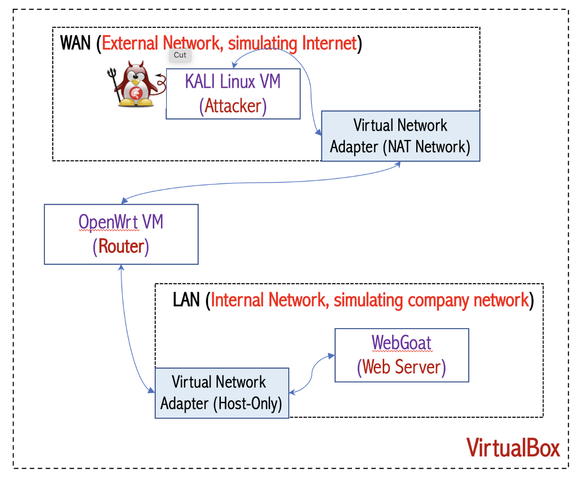
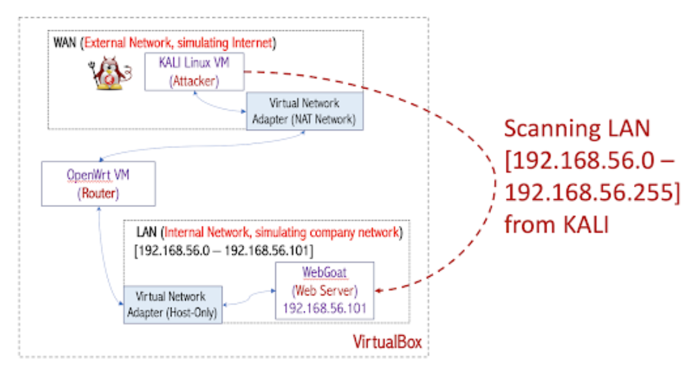
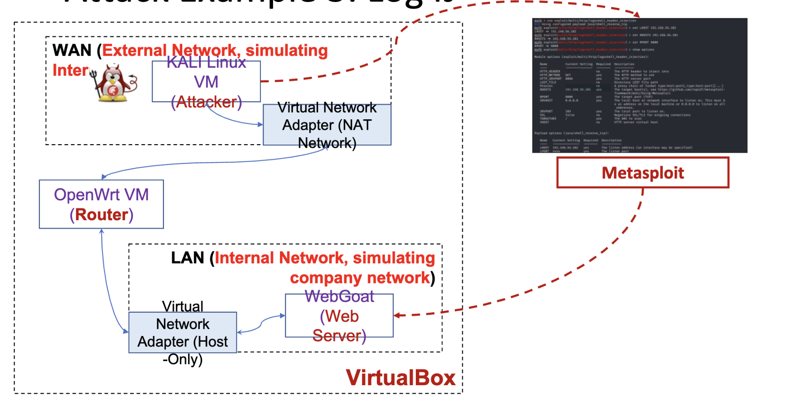
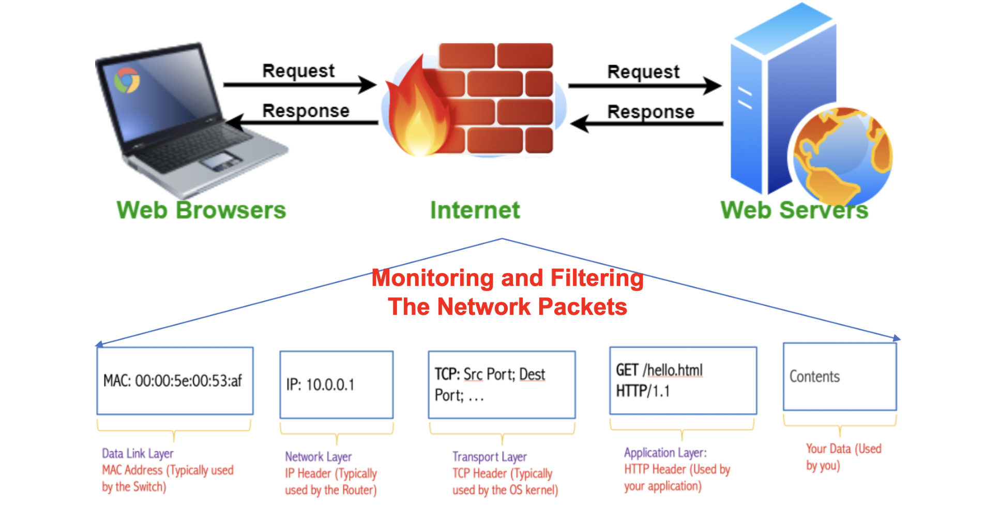
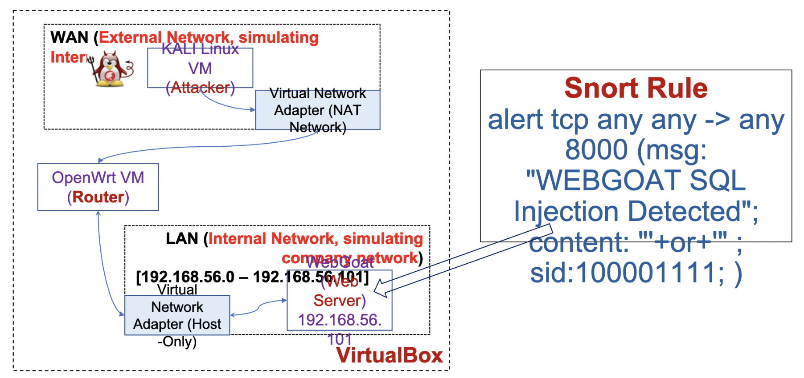
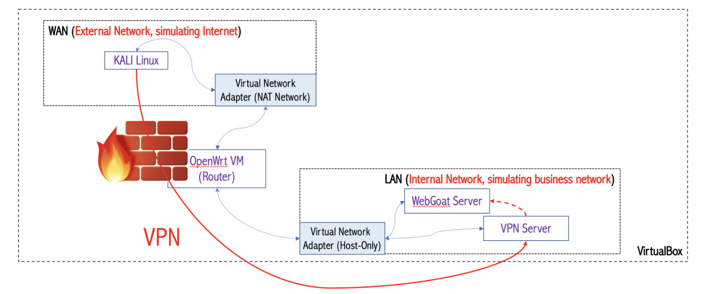
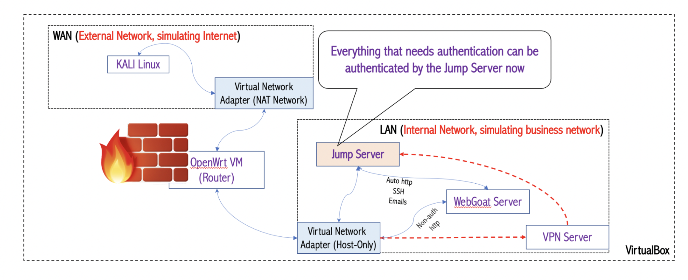
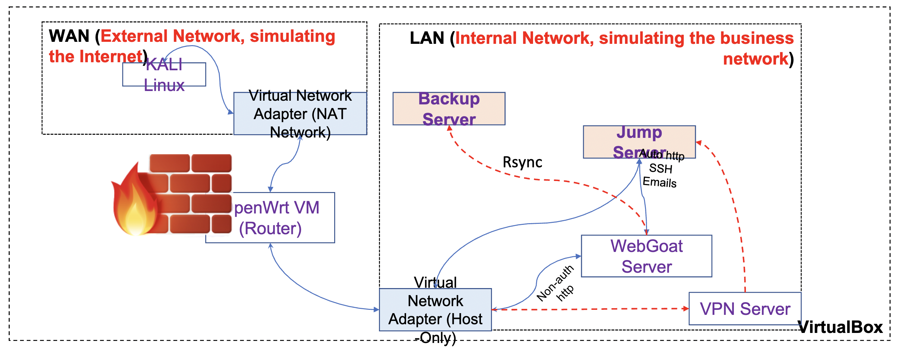
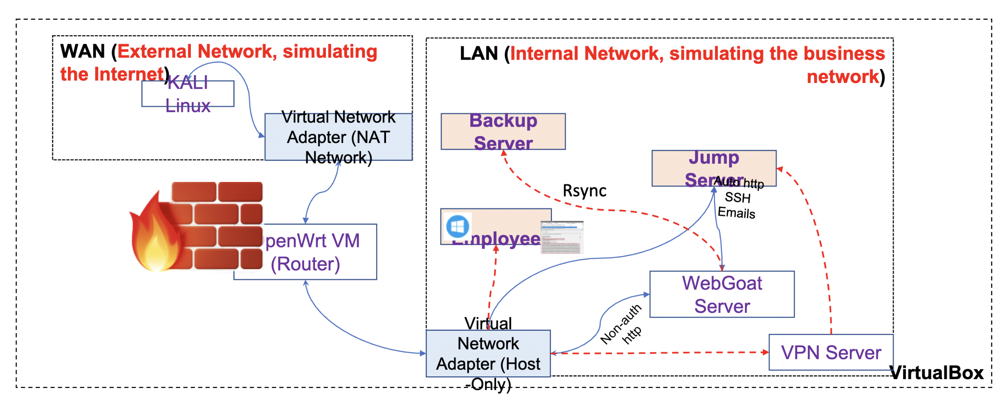

# PENTEST in Simulated Environment

## Lab 1: BUILDING THE REAL NETWORK

  

This lab aims to set up a simulating network that will be used throughout the project.

- Part A: Configuring a Local Area Network (LAN) to host our small-business network
- Part B: Configuring a Wide Area Network (WAN) to simulate the internet
- Part C: Configuring Port Forwarding on the OpenWrt Router for the WebGoat VM so the Kali Linux VM in the WAN Can Access the WebGoat VM

[Associated lab report](lab[1_13]/Lab1.pdf)

## Lab 2: PENETRATION TESTING: RECONNAISSANCE

  

This lab gives instructions on how to run basic reconnaissance from the WAN on the LAN in our simulating network.

- Part A: Discovering Active Machines in LAN by Using Nmap from Kali Linux in WAN
- Part B: Discovering Active Ports on the Web Server VM by Using Nmap from Kali Linux in WAN
- Part C: Brute Force Web Directory

[Associated lab report](lab[1_13]/Lab2.pdf)

## Lab 3: PENETRATION TESTING: ATTACK

  

This lab gives instructions on how to run basic attacks launched by Kali Linux in the WAN against the web server in the LAN.

- Part A: Brute Force Login Password of the Web Server
- Part B: SQL Injection Attack

[Associated lab report](lab[1_13]/Lab3.pdf)

## Lab 4: FIREWALLS

  

This lab aims to teach you how to configure a firewall.

- Part A: Blocking traffic from the WAN to the LAN unless the traffic is going to port number 8000 (the web service) in the WebGoat server

[Associated lab report](lab[1_13]/Lab4.pdf)

## Lab 5: INTRUSION DETECTION: SNORT

  

This lab aims to deploy `Snort` to detect exploits.

- Part A: Monitor Traffic From Kali Linux to the WebGoat Server
- Part B: Configure Snort on the WebGoat Server to Detect SQL Injection Attempts by Kali Linux

[Associated lab report](lab[1_13]/Lab5.pdf)

## Lab 6: VIRTUAL PRIVATE NETWORK (VPN)

  

This lab aims to add a `OpenVPN` to our LAN.

- Part A: Set Up a New VM as the VPN Server
- Part B: Set Up Port Forwarding in the Openwrt Router to Enable VPN
- Part C: Test WAN-LAN Connection Before VPN Is Running
- Part D: Connect to the VPN Server
- Part E: Test WAN-LAN Connection After VPN Is running

[Associated lab report](lab[1_13]/Lab6.pdf)

## Lab 7: JUMP SERVER

  

This lab aims to teach you how to add a jump server to the LAN.

- Part A: Set Up a New VM as the Jump Server
- Part B: Configure the Jump Server for Jump Service

[Associated lab report](lab[1_13]/Lab7.pdf)

## Lab 8: DATA BACKUP AND RECOVERY

  

This lab aims to add a backup server to our LAN and use it for data recovery through `Rsync` server.

- Part A: Set Up a new VM as the Backup Server
- Part B: Grant WebGoat SSH Access to the Backup Server
- Part C: Back Up Files on WebGoat to the Backup Server
- Part D: Simulate a Ransomware Attack and Data Recovery Afterward
- Part E: Recover the Data for WebGoat

[Associated lab report](lab[1_13]/Lab8.pdf)

## Lab 10: THREAT HUNTING WITH SYSMON

  

This lab aims to teach you how intruders and malware operate on your network using `Sysmon`

- Part A: Install Sysmon on the Windows VM
- Part B: Update the Configuration File to Enable Monitoring of Common Security-Sensitive Events
- Part C: Simulate a Reverse Shell Attack in the Windows VM
- Part D: Hunting the Reverse Shell Attack With Sysmon

[Associated lab report](lab[1_13]/Lab10.pdf)

## Lab 11: THREAT HUNTING WITH MEMORY DUMP

  

This lab aims to provide you with experience obtaining a dump of the physical memory from a victim Windows machine using `Winpmem` and threat hunting using `Volatility3`

- Part A: Capturing a Memory Dump of the Windows VM
- Part B: Forensics on Benign Behaviors of the Windows VM
- Part C: Forensics on Malicious Behaviors of the Windows VM

[Associated lab report](lab[1_13]/Lab11.pdf)

## Lab 12: THREAT HUNTING WITH NETWORK DATA

  

This lab aims to teach you how to perform network forensics using `wireshark` and `tcpdump`.

- Part A: Analyze DHCP Traffic With Kali Linux
- Part B: Analyze NetBIOS Traffic With Kali Linux
- Part C: Analyze HTTP Traffic With Kali Linux

[Associated lab report](lab[1_13]/Lab12.pdf)

## Lab 13: THREAT HUNTING WITH DISK DATA

  

This lab aims to give you experience obtaining a dump of the disk of a victim Windows machine using `FTK Imager`

- Part A: Dump the Disk of the Windows VM
- Part B: Disk Forensics With Autopsy

[Associated lab report](lab[1_13]/Lab13.pdf)

## Assignment 1: ETHICAL HACKING

In this assignment, you will be required to perform ethical hacking tasks against the web server.

- Part A: Set Up the LAN and WebGoat Server
- Part B: Another SQL Injection Attack
- Part C: Insecure Login Attack
- Part D: Authentication Bypass Attack

[Associated report](assignments/Assignment_1.pdf)

## Assignment 2: DATA BACKUP AND RECOVERY

In this assignment, you will need to configure the backup server (the rsync VM) to periodically and incrementally back up the data of the WebGoat server. You will also need to make sure that the backup server can only be accessed via SSH through the VPN server.

- Part A: Set Up the LAN and the WebGoat Server
- Part B: Set Up the VPN Server
- Part C: Set Up the Rsync Server

[Associated report](assignments/Assignment_2.pdf)

## Assignment 3: THREAT HUNTING

In this assignment, you will be given three offline threat-hunting tasks. The tasks take different forms: VM, memory dump, and network dump.

- Part A: Forensics on a VM Image
- Part B: Forensics on PCAP
- Part C: Forensics on Memory Dumps

[Associated report](assignments/Assignment_3.pdf)
